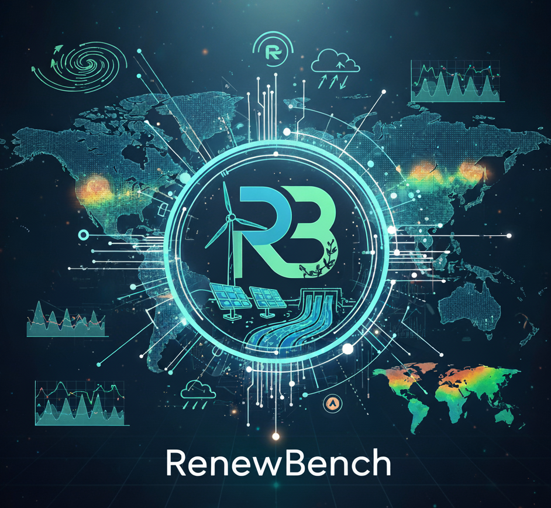

<p align="center">

</p>

# RenewBench Crawlers and Data Processing

[](https://www.python.org/downloads/)
[](https://opensource.org/licenses/MIT)
[](https://github.com/astral-sh/ruff)
[](https://results.pre-commit.ci/latest/github/RenewBench-Association/RenewBench-Crawler/main)
[](renewbench@lists.kit.edu)

## What is the RenewBench Crawler Repository?

This RenewBench repository contains code to download and process all data that is part of the RenewBench
dataset. This code is available in the RenewBench Crawlers `rcb` python package, and we also include example
configuration files and scripts to run the downloads.

## Installation
We heavily recommend installing the `rcb`package in a dedicated `Python3.11+` virtual environment. You can
install ``rcp`` directly from the GitHub repository via:
```bash
pip install git+https://github.com/RenewBench-Association/RenewBench-Crawler
```
Alternatively, you can install ``rcb`` locally. To achieve this, there are two steps you need to follow:
1. Clone the RenewBench-Crawler repository:
   ```bash
   git clone https://github.com/RenewBench-Association/RenewBench-Crawler
   ```
2. Install the package from the main branch. There are multiple installation options available:
   - Install basic dependencies: ``pip install .``
   - Install an editable version with developer dependencies: ``pip install -e ."[dev]"``

## Structure
The RenewBench-Crawlers repository is structured as shown below:
```
.
├── he he he - todo: https://tree.nathanfriend.com
```

## Documentation
Coming soon :fire:

### Data sources

| Region      | Source   | Platform                                                                            | Docs                                                                                                                 |
|-------------|----------|-------------------------------------------------------------------------------------|----------------------------------------------------------------------------------------------------------------------|
| Europe      | Entso-e  | [TP](https://transparency.entsoe.eu/)                                               | [API guide](https://transparencyplatform.zendesk.com/hc/en-us/sections/12783116987028-Restful-API-integration-guide) |
| Turkey      | EPIAS    | [TP](https://seffaflik.epias.com.tr/home)                                           | [Docs](https://seffaflik.epias.com.tr/electricity-service/technical/en/index.html)                                   |
| USA         | EIA      | [API browser](www.eia.gov/opendata/browser/)                                        | [API docs](https://www.eia.gov/opendata/documentation.php)                                                           |
| Canada      | IESO     |                                                                                     |                                                                                                                      |
| Chile       | CEN      |                                                                                     |                                                                                                                      |
| Australia   | AEMO     |                                                                                     |                                                                                                                      |
| New Zealand | EAT      |                                                                                     |                                                                                                                      |
| Taiwan      | Taipower | [Realtime data](https://www.taipower.com.tw/d006/loadGraph/loadGraph/genshx_e.html) | -                                                                                                                    |

## Guides

### Including a new data source

To create a data crawler for a new data source, you'll need to amend and
create several files. Here is an overview of the necessary changes to
include your `<source>`.
 You can always look at other crawlers such as `entsoe` for reference.

1. **Config** ([configs/](configs)): -----
    [Example: _entsoe.yaml_ file](configs/entsoe.yaml)

    Create a `<source>.yaml`. At minimum, it will
    require a destination directory (`paths/dst_dir_raw`) as well as any access
    information one might need to crawl the data (`access/...`), i.e. API
    tokens or account log-in data.
2. **Config loader** ([rbc/config/schema.py](rbc/config/schema.py)): -----
   [Example: _EntsoeConfig_ class](rbc/config/schema.py#L75)

    Amend the `schema.py` to
    - include a `class <Source>Config` with the attributes required by the
      `.yaml`.
    - add your class to the `SCHEMA_REGISTRY` at the bottom of the file.
3. **Downloader** ([rbc/downloaders/](rbc/downloaders)): -----
    [Example: _entsoe.py_ file](rbc/downloaders/entsoe.py)

    Create a `<source>.py` file containing a `class <Source>Downloader` to
    coordinate data crawling.
4. **Script** ([scripts/](scripts)): -----
    [Example: _entsoe_download.py_ file](scripts/entsoe_download.py)

    Create a `<source>_download.py` to run the downloader `<source>.py`.
5. **Tests** ([tests/](tests)): -----
    [Example: _source_configs_ function](tests/conftest.py#L16)

    In the`conftest.py`, update the dict returned by the `source_configs`
    function to include a dict version of your `<source>.yaml` with
    placeholders.

## How to contribute
Check out our [contribution guidelines](CONTRIBUTING.md) if you are interested in contributing to the RenewBench project :fire:.
Please also carefully check our [code of conduct](CODE_OF_CONDUCT.md) :blue_heart:.

## Acknowledgments
This work is funded under the Helmholtz UNLOCK Benchmarking call and supported by the
[Helmholtz AI](https://www.helmholtz.ai/) platform grant.


-----------
<div align="center">
  <a href="http://www.kit.edu/english/index.php"></a>
</div>

<div align="center">
<a href="https://www.helmholtz.ai/"></a>
</div>
